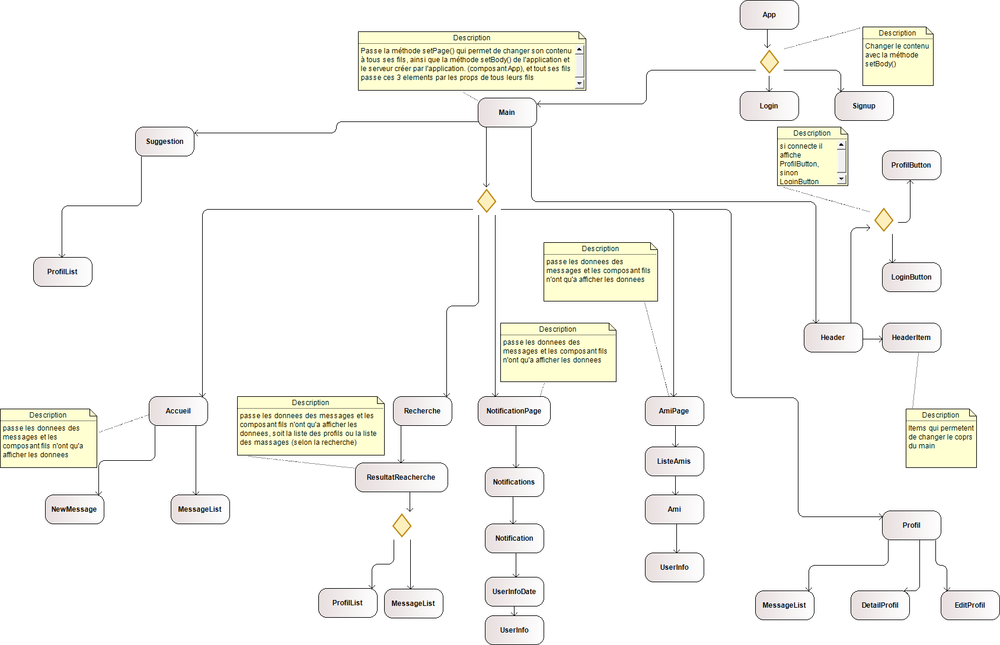
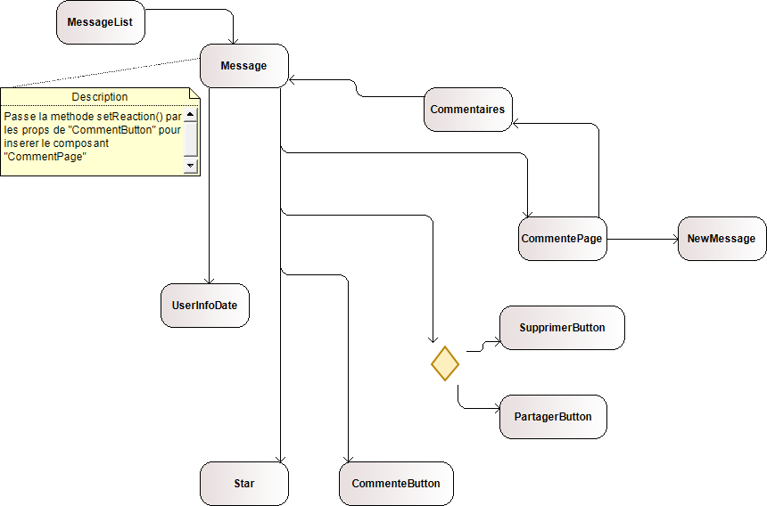
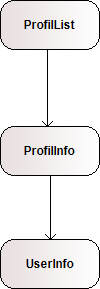

# Projet web | Spacie | RENDU_MI-PARCOURS

## Binome

- Hamid KOLLI 28717594
- Drouard François-Xavier 3800028

### Les repertoires et les composants

#### Les repertoires

- public : qui contient l'index.html qui sera afficher par le navigateur

- src : qui contient tous les autres repertoires et le fichier index.js qui met le composant principal dans le index.html, ainsi que le composant `App.js` qui est le composant principal.

- assets : qui contient les fichier `.css` et la police d'ecriture.

- pages : contient les deux sous repertoires `login` et `main` qui ont les composants fils direct de `App`

- login : a tout les composants qui sont utiliser pour l'authentification donc celui qui gère les connections et les inscriptions.

- main : a tous les repertoires qui sont liée avec la page principal, donc le main, `accueil` pour tout les composants qui sont dans la page d'accueil dont le principal est `<Accueil />`, `listeAmis` qui a tout les composants qui gere une liste d'amis et le composant conteneur qui est `<AmiPage />`, `notification` qui  comme composant principal `NotificationPage`, `profil` qui a comme composant principal `<Profil />` et `recherche` qui a comme composant principal `<Recherche />`, ainsi que les deux composants: `<Main />` qui est le principal et `<Suggestion />` qui est un composant utilisé par le main.

### Les composants

### Principal

- `<App />` elle crée le serveur axios et elle le passe par les props de tous les composants ainsi qu'une methode `setBody` qui permet de changer le state de ce composant en inserant le composant qui sera afficher par le navigateur, donc ce composant a comme état la page qu'on met a jours à chaque fois par `setBody`

#### Login

> `<LoginButton />` n'a pas de state, il a une methode connect, elle fait appel à la methode `setBody` pour inserer le composant `<LoginPage />`.
> `<LoginPage />` a comme attribut le login et le password, et dans les states un message d'erreur `messageErreur`, elle a comme methode `connecte` qui fait une requette au serveur pour s'authentifier, si le serveur retourne une erreur, elle met a jour l'etat de `messageErreur` sinon elle appel `setBody` pour inserer le composant `<Main />`, elle a `gotoSighUp` et `gotoAccueil` qui inseré le composant `<SignUp />` et `<Main />` avec `setBody`, et une methode `getErreur` qui retourne `messageErreur`
> `<SignUp />` a comme attribut : login,date,email,motDePasse,confPassword qui sont les valeurs des champs à remplir et dans les states un message d'erreur `messageErreur`, les methodes `gotoConnection`, `gotoAccueil` qui appelle `setBody` en inserant `<LoginPage />` et `<Main />`,  une methode `getErreur` qui retourne `messageErreur` et une methode `signUp` qui fait une requette au serveur et qui met à jour le message d'erreur ou appelle `setBody`
  
#### Main

> `<Main />` a la page du millieu comme state, elle est mise à jour par les composant fils (la methode `setPage` est passé à tous les composants fils de `<Main />`), elle affiche le `<Header/>` tout en haut, `<Suggestion/>` à gauche, la page du state au millieu et un `

` pour `les pubs` (//TODO) a droite

- accueil :

> `<Accueil />` : state est vide, recupere le token des cookies, la methode `getNewMessageComponent` retourne `<NewMessage />` si le token n'est pas vide, ce composant affiche donc `<NewMessage />` et la liste des messages `<MessageList/>`
> `<NewMessage />`: state a : un boolean check pour savoir si le message est privée ou pas, une image en base64, un message d'erreur et le message qui sera publié.  recupere le token des cookies, comme methode, `sendMessage` qui fait une requette au serveur, `checkPubPrivee` qui change l'etat du boolean check, `imagePicker` qui gere la publication d'une image et `onEmojiClick` qui recupere l'emoji du `<Picker />`
> `<MessageList/>` : le state est vide, elle n'a aucune methode, le rander affiche les messages en passant par les props de `<Message />` les données du message
> `<Message />` : le state a reaction qui est initialisé à null, elle a les methodes geters `getNombreStars` , `getNombreCommentaires`, `getNombrePartages` , `getReaction` et un seter `setReaction` qui est passe par les props de `<CommenteButton />`, dans le render elle affiche les infos de l'utilisateur qui a publié ce message (`<UserInfoDate />`) le message et les buttons pour liker (`<Star />`), commenter (`<CommenteButton />`),partager (`<PartagerButton/>`) ou  supprime (`<SupprimerButton/>`) si l'utilisateur est l'utilisateur courant
> `<Star />` : state a `isLiked` qui est mit à jour lors d'un clique et la methode `aimerPublication` qui met a jour le state et appelle `setBody` si l'utilisateur n'est pas connecter
> `<SupprimerButton />` n'a pas de state, une seule methode `supprimer` (//TODO)
> `<PartagerButton />` n'a pas de state,la methode `partgerPublication` qui  appelle `setBody` si l'utilisateur n'est pas connecter (`<LoginPage />`)
> `<CommenteButton/>` n'a pas de state, elle recupere le token dans un attribut et elle a un attribut visible qui permet d'inserer ou pas `<CommentePage/>` dans `reaction` de `<Message />`, la methode `commentairePublication` est appeler lors d'un clique, elle met à jour l'attribut `visible`, si le token est vide elle appelle `setBody` sinon si visible est true elle insere `<CommentePage/>` dans le message avec la methode `setReaction` passé par les props
> `<CommentePage/>` : n'a pas de state, elle affiche `<NewMessage />` pour publier un commentaire et la liste des commentaires `<Commentaires />`, et elle recupere les données des commentaire avec la methode `getCommentsOfMessage`
> `<Commentaires />` n'a pas de state, elle boucle sur tout les données passé par les props et elle crée pour chaque une d'elle un `<Message comment={true} />` (un commentaire est un message sans les boutons commenter et partager)

- general

> `<UserInfo/>` n'a pas de state, il a une seule methode `gotoProfil` qui appelle `setPage` de `<Main/>` en inserant `<Profil />`, cette methode est appeller lorsqu'on clique sur le nom ou la photo du compte
> `<UserInfoDate/>` affiche `<UserInfo/>` avec une date à coté

- header

> `<Header/>` n'a pas de state, il affiche le logo et tout le menu de navigation qui sont des `<HeaderItem />` et `<LoginButton/>` si l'utilisateur n'est pas connecter `<ProfilButton/>` sinon
> `<HeaderItem/>` initialise l'image et met le handler `onClick` par les valeurs passées par les props

- listeAmis

> `<Ami/>` n'a pas de state, affiche `<UserInfo/>` avec les données passés par les props et à un bouton `Bloquer` (//TODO)
> `<AmiPage/>` n'a pas de state, affiche `<ListeAmis/>` en passant les données des comptes à afficher
> `<ListeAmis/>` n'a pas de state, affiche un ensemble de `<Ami/>` en passant les données du compte à afficher

- notification

> `<Notification/>` n'a pas de state, affiche `<UserInfoDate/>` en passant les données par les props, affiche le contenu de la notification et un button `Consulter` (//TODO)
> `<Notifications/>` n'a pas de state, affiche un ensemble de `<Notification/>` en passant les données de chaque notification par les props
> `<NotificationPage/>` n'a pas de state, affiche `<Notifications/>` en passant les données de toutes les notifications par les props

- recherche
  
> `<Recherche/>` a comme state `refraiche` qui est initialement null, affiche un champs de recherche et un button `Rechercher`, lors du clique sur le button la methode `rechercher` est appellé, elle met à jour l'etat `refraiche` en inserant `<ResultatReacherche />`
> `<ResultatReacherche/>` n'a pas de state, fait une requette au serveur avec les données passées par les props, elle recupere le resultat et elle affiche soit `<MessageList />` ou `<ProfilList/>` selon la recherche

- profil
  
>`<ProfilButton/>` n'a pas de state, a un bouton qui permet de visiter le profil en appellant la methode `setPage`
> `<Profil/>` n'a pas de state, affiche le contenu du profil, et genere la liste des messages publier par cet utilisateur, à 3 boutons `deconnecter` qui appelle `setBody`
`modifier` qui affiche `<EditProfil/>` dans une popup et `details` qui affiche `<DetailProfil/>`  dans une popup
> `<DetailProfil/>` n'a pas de state, elle affiche les données du profil passées par les props et un bouton `close` qui ferme la popup
> `<EditProfil/>` a comme state tous les infos d'un utilisateur qu'il peut modifier (nickName, photo,biographie,email et un message d'erreur), deux attribut, le nouveau mot de passe et sa confirmation, une methode `getErreur` et `sauvegarder` qui fait une requette au serveur et met a jour le message d'erreur, un button `sauvgarder` qui lors du clique appelle `sauvegarder` et un bouton `close` qui ferme la popup
> `<ProfilInfo/>` n'a pas de state, affiche `<UserInfo/>` et un button `Ajouter` (//TODO)
> `<ProfilList/>` n'a pas de state, affiche un ensemble de `<ProfilInfo/>` en passant les données du profil par les props

- Suggestion
  
> `<Suggestion/>` n'a pas de state, affiche `<ProfilList/>` en passant les données des profils par les props si le token n'est pas vide, rien sinon.

### Les arbres de composants

- L'arbre complet :
  

- L'arbre des messages :
  

- L'arbre des listes de profilInfo :
  

